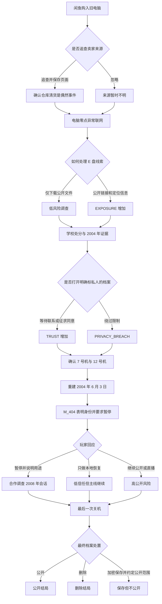

# Still Online

> 中文暂定名：《零点以后请勿登录》  
> 类型：网络考古、青春恋爱、中式心理恐怖、怀旧悬疑、互动叙事、ARG

## 一句话概念

玩家起初以为自己在调查一场发生于旧网吧的网络灵异事件，最终却发现，他们正在帮助两个被困在 2000 年代互联网记忆中的少年完成一场迟到了二十年的告别。

## 核心命题

> 如果一个人的青春只存在于聊天记录、个人主页和游戏存档里，那么删除这些文件，算不算让他死去第二次？

故事以灵异传说为入口，以青春、恋爱、教育压力和数字记忆为核心。恐怖不只来自一个死后仍然在线的账号，也来自成年人曾经看见少年的求救，却将它解释成早恋、叛逆、懒惰或网络成瘾。

## 标题

### 英文名

**Still Online**

标题包含几层含义：

- 一个本应永久离线的账号，二十多年后仍然在线；
- 已经结束的关系依然留存在互联网中；
- 逝去的人通过数字痕迹继续存在；
- 活着的人始终未能从那段往事中真正下线。

### 中文名

**《零点以后请勿登录》**

中文标题强调午夜网吧、禁忌规则和都市传说感；英文标题则更侧重记忆、等待和情感余韵。

暂定宣传语：

> He died in 2004. His account never logged off.

## 故事背景

故事的历史线横跨 2002 至 2008 年，当代线则从玩家购入一台老电脑开始。主要地点是一座中国县城及其已经关闭的老网吧“星河网络世界”。

当代，一名经营怀旧互联网频道、喜欢修复老电脑的内容创作者，在闲鱼上以 168 元同城购入一台“以前网吧淘汰、能通电、不保证能进系统”的旧主机。卖家只是替即将拆除的仓库清理存货，并不知道它的来历。泛黄的机箱侧面贴着“星河网络世界 07”，系统属性中的计算机名却是 `XINGHE-12`。

玩家第二次尝试才成功进入 Windows XP。系统上次登录时间是 2008 年 8 月 8 日，桌面看起来只是普通的旧网吧客户机。系统时钟随后自行跳回 2004 年 6 月 3 日 23:58；到零点时，宽带连接窗口在没有接入旧式网络设备的情况下显示连接成功，Internet Explorer 自动打开“零点以后”。

旧网址仍然可以访问。它是一座仿佛停留在 2003 年的个人主页：蓝色星空背景、闪烁文字、滚动公告、MIDI 音乐、友情链接、留言板，以及一个永远显示“1 人在线”的聊天室。

网站来自两名高中生共同制作的私人空间“零点以后”。当玩家尝试恢复其中的数据，聊天室里那个二十年没有下线的账号第一次主动发来消息：

```text
宇宙尽头：小满？
宇宙尽头：这次是你吗？
```

## 核心人物

### 林宇

- 年龄：17 岁；
- 身份：重点中学高二学生；
- 网名：`宇宙尽头`；
- 性格：安静、敏感、成绩优秀，会讲冷笑话，也喜欢研究网页技术；
- 家庭：父亲是学校教导主任，对他的成绩、隐私和未来进行严格控制。

林宇在学校是名次，在家中是父母的希望，只有在陈小满面前才觉得自己是一个具体的人。他的悲剧不应被归结为性格脆弱，而是长期压力、情感羞辱和求助渠道缺失共同造成的结果。

代表性表达：

> 我不是怕考不上。我是怕考上以后，他们会说，你看，我们当初对你那么狠是对的。

### 陈小满

- 年龄：16 岁；
- 身份：转学生；
- 网名：`海是蓝色文件夹`；
- 爱好：画画、制作网页、写网络小说；
- 性格：表面比林宇勇敢，实际上害怕冲突，也习惯隐藏自己的痛苦。

她并非等待被拯救的恋爱对象，而是故事真正的叙述者、隐瞒者与幸存者。成年后，她成为普通的网页维护人员，保存了大量旧资料，却二十年不敢重新打开它们。

她的网名来自一句话：

> 因为我家电脑里没有海，只好建一个文件夹。

### 周成海

“星河网络世界”的老板，嘴硬心软。他允许学生赊账，也会在检查时保护偷偷上网的未成年人；但他并非完美的保护者，曾因害怕惹事将部分硬盘交给学校。

他的网吧账本保存着两人关系中最日常的痕迹：

```text
7 号：欠 4 元
12 号：替 7 号付
7 号：还 12 号一瓶汽水
```

### 林国栋

林宇的父亲，也是学校教导主任。他来自更贫困和严苛的一代，真心相信考大学是孩子唯一的出路，也因此将爱表达为控制、牺牲和成绩要求。

他不应被塑造成单纯的恶人。他最具悲剧性的地方，是始终无法承认自己的教育方式造成过伤害，只能重复：“我做的一切都是为了他。”

林宇对此留下的文字是：

> 这句话像一把没有凶手的刀。

### 成年后的陈小满

她以匿名用户 `M_404` 参与玩家的调查，一边提供线索，一边阻止玩家打开部分文件。她担心的不只是痛苦的回忆，也担心两人的人生再次被包装成供人消费的猎奇故事。

## 两人的关系

2002 年至 2004 年间，林宇与陈小满经常在星河网吧见面。学校严禁早恋、上网和一切被认为与考试无关的活动，两人不敢在校园公开交谈，只能坐在网吧相隔很远的电脑前，通过 QQ 和聊天室交流。

他们共同制作了名为“零点以后”的网站，并约定高考结束后一起去北京、看看真正的互联网公司，也一起去看海。

两人的爱情应当保持轻盈、笨拙和生活化，不以直白表白或戏剧化牺牲为主。重要的情感细节包括：

- 替对方付一小时网费；
- 在自习课偷偷画网站布局；
- 用软盘或小容量 U 盘交换文件；
- 用网页标题传递不能写进聊天记录的话；
- 约定吵架时也不能删除对方的 QQ；
- 攒钱购买只能续费一年的域名；
- 为对方制作粗糙的 JavaScript 雪花效果；
- 建立一个叫“海”的文件夹，等待以后放入两人去过的地方。

示例聊天记录：

```text
2003-09-17 23:41:08 宇宙尽头
你为什么叫海是蓝色文件夹

2003-09-17 23:42:51 海是蓝色文件夹
因为我家电脑没有海
只好建一个文件夹

2003-09-17 23:43:20 宇宙尽头
那里面有什么

2003-09-17 23:45:02 海是蓝色文件夹
现在没有
以后放我们去过的地方
```

## 过去发生的事件

2004 年春天，学校发现两人的关系。为了维护纪律和升学率，学校将林宇的心理状态归结为早恋和网络成瘾，并要求他公开承认陈小满影响了自己的成绩。

林宇被迫写下一封绝交信：

> 我从来没有喜欢过你。请你不要再影响我的前途。

但网页源代码中藏着未被交出的原稿：

> 他们要我说没有喜欢过你。可我不想让他们连我的喜欢也一起没收。

随后，陈小满被家人强行送往封闭式“行为矫正学校”，与外界隔绝十一个月。林宇则在高考前夕从教学楼坠落，官方记录称其因学习压力发生意外。

陈小满回来时，林宇已经去世，网吧也因事件短暂停业整顿。她试图取回“零点以后”的服务器资料，但遭到阻止。网吧恢复营业后，老板发现已经断网的 7 号机每天凌晨零点仍会自动登录聊天室，并不断发送同一句话：

> 小满，我已经到了。你怎么还没上线？

## 历史时间线

2004 年是悲剧的中心，而不是所有资料停止产生的终点。2005 至 2008 年留下的使用记录，让玩家必须判断林宇死后究竟是谁继续操作电脑、整理文件和回复消息。

| 年份 | 故事事件 | 互联网与媒介特征 |
| --- | --- | --- |
| 2002 | 林宇与陈小满在星河网吧认识 | 拨号与早期宽带并存、聊天室、个人主页 |
| 2003 | 两人建立“零点以后”，约定以后去北京和看海 | QQ、FrontPage、Flash、网吧游戏、软盘 |
| 2004 | 学校处分两人，陈小满被送走，林宇死亡 | 原始聊天记录与关键事件档案形成 |
| 2005 | 陈小满回来，开始寻找散落在网吧和旧电脑中的文件 | 旧网站失效，资料通过光盘和 U 盘转移 |
| 2006 | 她将找回的文件上传至永硕 E 盘 | “二次档案”形成，上传时间与原始日期分离 |
| 2007 | E 盘继续更新，并出现来源无法解释的新文件 | QQ 空间、博客、MP3 与家庭宽带逐渐普及 |
| 2008 | 星河网吧关闭，电脑完成最后一次同步后进入仓库 | 旧主页时代结束，电脑被封存 |
| 当代 | 玩家从闲鱼购入旧主机并使其重新联网 | 过去的本地档案、旧网站和 E 盘重新连接 |

2008 年 8 月 8 日晚，网吧中的人都在观看北京奥运会开幕式。陈小满独自进入即将关闭的星河网吧，准备完成最后一次文件同步。聊天室却出现一句不应存在的消息：

```text
宇宙尽头：今天北京是不是很热闹？
```

“去北京”是两人在 2003 年的约定。陈小满没有回答，而是直接拔掉电源。电脑因此留下未正常关机、文件损坏和待恢复会话的状态，此后被存入仓库，直到当代被玩家购得。

## 真相层次

### 第一层：网吧灵异传说

玩家最先接触的是一个传统网络都市怪谈：

- 7 号机断电后仍会运行；
- 监控中偶尔出现穿旧校服的男生；
- 聊天室人数从 1 变成 2，但日志中只有一个 IP；
- 网站访客计数器显示玩家当前时间，年份却固定为 2004；
- 网吧合影角落的人影会在每次查看时逐渐接近镜头；
- 每逢零点，网页标题会变成“你替她来了吗”。

玩家会认为林宇死后成为了网络中的幽灵，仍在等待失踪的陈小满。

### 第二层：被成年人改写的青春

玩家通过被删除的聊天记录、处分通知、家长会录音、作文批注和网吧账本，发现所谓“问题学生”的故事是由成年人共同建构的。

恐怖的重心从超自然现象转向现实中的监视、羞辱和控制：日记被检查、房门不能上锁、QQ 密码被上交、哭泣被视为软弱，一切爱好都必须证明对高考有用。

林宇曾写道：

> 在学校我是名次，在家里我是希望。只有在你这里，我像一个人。

### 第三层：真正等待的人

玩家最终发现陈小满没有死。她并未安排玩家买到这台电脑，而是在沉寂多年的 E 盘重新产生访问记录后，以 `M_404` 的身份介入调查。那个在聊天室中回应玩家的“林宇”可能由三部分组成：

- 林宇留下的聊天记录和自动回复脚本；
- 陈小满二十年来断断续续补写的内容；
- 没有任何源文件出处、无法解释的新消息。

作品不明确回答这是脚本、记忆、幸存者的自我欺骗，还是林宇真的留在了互联网中。

最终的情感反转是：林宇并不是唯一等待的人。真正二十年不敢登录聊天室的人，是仍然活着的陈小满。

## ARG 载体

### Windows XP 老电脑界面

游戏使用 [XP.css](https://github.com/botoxparty/XP.css/) 构建旧电脑的 Windows XP 风格界面。玩家操作的不是抽象调查面板，而是从闲鱼买到的实体主机。界面主要承载登录窗口、桌面、开始菜单、任务栏、资源管理器、宽带连接、Internet Explorer、记事本、错误提示框和文件属性窗口。

桌面最初包含“我的电脑”“我的文档”“网上邻居”“Internet Explorer”“回收站”“腾讯 QQ”“千千静听”“星河网吧管理系统”和“宽带连接”。随着数据恢复，新的图标、快捷方式和窗口会逐步出现；已经关闭的窗口也可能以不同内容再次弹出。

界面需要保留明确的功能分层：

- Windows XP 桌面是玩家获得的旧电脑本身，用于整理线索和推动章节；
- “零点以后”个人主页保留 2000 年代初中文互联网的网页审美；
- 永硕 E 盘尽量通过真实页面或忠实的只读快照参与 ARG；
- XP.css 只负责视觉组件，不负责虚拟文件系统、窗口状态、时间异常、游戏存档或谜题逻辑；
- 移动端可以将窗口改为单窗口模式，但不改变关键信息与解谜路径。

最终实现前需要确认 XP.css 当前版本的许可证要求、依赖方式、浏览器兼容性和可访问性，并在项目第三方许可清单中保留所需信息。

游戏不追求完整复刻 Windows XP。所有系统功能只服务于叙事和解谜，避免让玩家在无关的操作系统细节中迷失。

### 7 号机外壳与 12 号机身份

玩家买到的机箱贴着 7 号机标签，Windows 登录用户名也是 `XH07`，但系统属性、网卡名称和部分路径却指向 `XINGHE-12`。随着调查推进，玩家发现网吧平面图上根本没有 12 号机。

真相是：机箱原本属于公开营业区的 7 号机，硬盘却来自储物间里从不登记、从不联网的 12 号机。2008 年网吧关闭时，陈小满请求周成海不要销毁 12 号机中的资料，周成海于是将它的硬盘装入报废的 7 号机机箱，再把主机放入仓库。玩家前期会怀疑陈小满、周成海或未知的第三者，最终可通过 2008 年监控残片、维修登记和陈小满的陈述交叉确认。

### 旧式个人主页

网站模拟 2000 年代初的中文个人主页，包括：

- 800×600 固定布局；
- 星空 GIF、闪烁文字和彩虹分隔线；
- MIDI 音乐、滚动公告和访客计数器；
- 留言板、友情链接和 QQ 在线状态；
- IE 6.0 最佳浏览提示；
- 失效图片、红叉和“正在建设中”图标；
- FrontPage 式表格布局及早期学生审美。

这些元素不仅用于怀旧，也应参与叙事和谜题。例如，只有在 800×600 分辨率下，错位的表格才会组成一句完整的话。

### 永硕 E 盘（ys168）

永硕 E 盘是连接游戏内档案与开放互联网 ARG 的关键入口。它应当呈现为一个仍在维护、但结构明显属于旧互联网时代的个人文件空间，而不只是剧情中被提到的品牌。

陈小满从矫正机构回来后，陆续从软盘、网吧备份盘和旧电脑中找回两人的文件。原始网站随网吧关闭而失效，她后来将部分资料上传到一个永硕 E 盘，作为低调、便于长期保存的镜像。她没有公开解释这些文件，只把 E 盘地址藏进网吧会员卡、旧主页友情链接和 7 号机桌面快捷方式中。

E 盘暂定显示名为“海是蓝色文件夹”，目录表面像普通学生时代的个人收藏：

```text
海是蓝色文件夹/
├── 网页素材/
├── 作文和信/
├── 星河网吧备份/
├── 不好听的歌/
├── 去北京要查的东西/
└── 不要下载/
```

其中混有不完整网页素材、低音质录音、作文草稿、网吧管理系统备份和带密码的压缩包。目录公告、文件说明、上传时间、下载次数、排序方式和失效链接都可以成为线索。

E 盘在叙事上代表“第二次保存”：文件内容可能来自 2004 年，但上传、重命名和整理发生在更晚的时间。玩家因此必须区分三个日期：原文件创建日期、陈小满重新发现它的日期，以及上传到 E 盘的日期。三者的差异将逐步暴露 `M_404` 的身份。

实际 ARG 应避免要求玩家攻击网站、猜测真实用户密码或干扰平台和其他用户。所有需要登录、删除、改名或恢复的行为，都应发生在游戏自建界面中；公开的永硕 E 盘只提供策划方控制的只读线索和下载内容。若真实平台的稳定性、规则或外链能力不适合长期运营，应保留经过授权的静态快照作为备用入口，并在叙事中解释为网页缓存。

### QQ 聊天记录

聊天记录是恋爱线的主要载体。内容从日常玩笑逐渐变为隐晦求助，并出现删改、时间跳跃和身份混淆。部分消息的发送时间晚于林宇的死亡日期。

### 网吧管理系统

以仿旧网吧管理软件呈现会员编号、余额、上机记录、机器状态、锁屏消息和管理员广播。

林宇与陈小满表面上从未同时上网，因为老板曾把其中一人的上机记录登记为“设备维护”，帮助他们躲避学校检查。

### 手机、座机与录音

可以使用诺基亚式短信界面、拨号上网声、CRT 电流声、网吧键盘声、校园广播、磁带录音和老式座机留言。

两人也会使用简短暗号，例如“今晚有雨”表示家长正在检查聊天和日记，暂时不要联系。

### 实体物料

可用于传播或核心玩家体验的物料包括：

- 网吧会员卡；
- 手写上网登记簿；
- 软盘、盗版软件光盘和充值卡；
- 作文、处分通知和高考倒计时表；
- 大头贴、公交票和网页代码教程；
- 写有旧网址、路径或登录信息的纸条。

## 谜题原则与示例

谜题应自然产生于当时的媒介、技术和生活环境，而不是随意附加密码学题目。

### 乱码邮件

玩家将文本编码从 UTF-8 切换为 GB2312，才能看见正文。它同时表达一个叙事隐喻：同一句话没有消失，只是长期被用错误的方式理解。

### 红叉图片

七张加载失败的图片具有如下文件名：

```text
wo.jpg
mei.jpg
you.jpg
bu.jpg
xi.jpg
huan.jpg
ni.jpg
```

组合后得到“我没有不喜欢你”。恢复图片后，每张都是林宇检讨书的一部分。

### 软盘容量

一个 1.44 MB 软盘镜像中的文件总大小超过容量，暗示文件类型被伪装。将 `.bmp` 恢复为实际格式后，可获得陈小满没有寄出的信。

### 网吧座位图

按照聊天记录中的机器编号在网吧平面图上连线，最初形成“走”字；加入被隐藏的 12 号机记录后，它会变成“等”。

### 网页缓存

当代页面已被陈小满修改。玩家需要比较不同年份的缓存，识别哪些文字属于 2004 年，哪些是她成年后补写的内容，从而质疑“旧资料必然真实”的假设。

### 多年份系统时间

电脑的系统时间会根据玩家进入的档案层发生变化：

```text
正常启动：2008-08-08 19:55
打开“零点以后”：2004-06-03 23:58
进入永硕 E 盘：2006-11-17 00:14
进入聊天室：当代日期 00:00
```

玩家最初会将它解释为主板电池失效，后来才发现每个日期都对应一次关键事件：2004 年是林宇等待的时间，2006 年是陈小满开始建立二次档案的时间，2008 年是电脑被封存的时间，当代则意味着三层档案重新连接。

### 媒介年代辨认

玩家可以通过媒介特征判断文件年代和可能的作者。2002 至 2004 年的林宇资料更常见简单 HTML、FrontPage、GIF、MIDI、软盘、智能 ABC 和 GB2312；2005 至 2008 年的陈小满资料则更多出现永硕 E 盘、QQ 空间、博客、MP3、数码照片、U 盘和宽带下载记录。

文件声明的日期如果与其编码、软件版本或媒介特征冲突，就意味着它被事后改写或伪装。

### E 盘目录排序

一个目录默认按照最近更新时间排列，看起来只有普通网页素材。7 号机桌面上的便签却写着“不要看它什么时候放上去，要看它本来什么时候写完”。玩家需要下载文件并比较文件属性中的创建日期，再按照原始日期排列首字，得到下一级目录的名称。

这个谜题第一次明确告诉玩家：E 盘不是 2004 年的原始现场，而是有人在事后精心整理的档案。

### 下载次数异常

一个从未公开的压缩包显示有两次下载。第一次来自陈小满上传后的自检，第二次却发生在玩家找到链接之前。对应的 Windows XP 文件属性窗口会多出一条不存在于本地日志中的“远程访问”记录，使超自然解释与人为监视两种可能同时成立。

### 失效链接与快捷方式

E 盘中一条失效链接的地址尾部是一串数字。将它与 7 号机桌面上 `.url` 快捷方式的图标编号组合，能够恢复旧主页的隐藏路径。谜题需要跨越游戏内桌面与公开网页，体现 ARG 的媒介穿透感。

## 初步章节结构

### 第一章：一人在线

玩家从闲鱼同城购入一台贴着 7 号机标签的老式主机。第二次启动后，电脑进入 Windows XP；到零点时，它在未接入旧式网络设备的情况下自动连接网络，并通过 Internet Explorer 打开旧网站。章节结尾由林宇账号主动询问玩家是不是小满。

### 第二章：星河网络世界

玩家调查会员记录、网吧账本和老板录音，逐渐了解两人的日常关系。桌面上的“网上邻居”会恢复一个指向永硕 E 盘的快捷方式，玩家第一次看到“海是蓝色文件夹”。E 盘在玩家访问后出现新的更新时间。整体偏温暖，为后续情节建立情感基础。

### 第三章：早恋处分

学校档案进入故事。玩家看到成人口中的两个“问题学生”，并发现不同材料互相矛盾。恐怖开始从鬼怪转向现实中的教育压力与控制。

### 第四章：不存在的十二号机

网吧平面图只有十一台机器，记录中却不断出现 12 号机。玩家结合系统属性与硬件记录，发现自己买到的是 7 号机外壳与 12 号机硬盘的组合。12 号机原本是储物间里一台不联网的旧电脑，两人通过软盘在其中交换文件，“零点以后”也诞生于此。

### 第五章：2004 年 6 月 3 日

玩家重建林宇死亡前的最后一天。证词互相冲突，重点不是呈现死亡过程，而是辨认当时被忽视的求救信号。

### 第六章：M_404

玩家通过 E 盘文件的上传时间、目录公告修订记录和文件命名习惯，确认整理档案的人一直活到了当代。匿名协助者被揭示为成年陈小满。她要求玩家停止调查，并在游戏自建界面中撤回未授权的私人内容。玩家必须面对一个伦理问题：发现真相是否等于有权公开一切？

### 第七章：最后一次关机

玩家恢复 2008 年 8 月 8 日的未完成会话，得知陈小满在网吧关闭前进行过最后一次同步，也看到“今天北京是不是很热闹”的异常消息。她当时直接切断电源，此后再未登录。玩家由此理解电脑为何被调换硬盘、为何存在损坏文件，以及她二十年不敢回来的原因。

### 第八章：零点以后

陈小满第一次以自己的名字登录聊天室。玩家可以帮助恢复消息，但不能替她决定说什么。

```text
林宇：你迟到了。
陈小满：对不起。
林宇：没关系。你来了就好。
```

最后一句不在任何脚本、缓存或已知聊天语料中。

## 故事树与分支规则

### 设计原则

故事采用“固定历史、可变调查、可变关系、可变处置”的结构。林宇与陈小满的过去不会因玩家选择而改变；玩家真正决定的是哪些证据被发现、陈小满是否愿意参与最后的对话，以及档案最终被公开、删除还是受控保存。

所有主线关键事实都至少有两条获取路径。玩家错过一条线索时，可以付出关系、完整度或公开风险方面的代价，从另一条路径继续，不能因单次选择永久卡死。超自然现象保持不可证实，不设置“识破鬼是否真实”的正确答案。

### 不可改变的幕后事实

以下事实对所有周目一致，避免分支产生互相冲突的历史：

1. 林宇与陈小满于 2002 年相识，2003 年共同建立“零点以后”。
2. 学校和家庭在 2004 年以早恋、网络成瘾为由拆散两人；陈小满被强制送走，林宇随后死亡。
3. 陈小满于 2005 年回来，2006 年开始用永硕 E 盘保存找回的资料。
4. 2007 年以后，E 盘中出现无法由原始资料解释的新消息。
5. 2008 年 8 月 8 日，陈小满看到“今天北京是不是很热闹”的消息后直接断电。
6. 陈小满请求保留 12 号机资料，周成海将 12 号机硬盘装入 7 号机机箱并存入仓库。
7. 当代卖家只是清理仓库，没有参与陈小满的安排，也不知道电脑的秘密。
8. `M_404` 是成年陈小满；她因为 E 盘再次出现访问记录才介入调查。
9. 林宇账号包含自动回复脚本和陈小满补写的内容，但部分当代消息没有可追溯来源。

### 分支状态

实现时使用少量可解释状态，避免建立难以维护的海量组合。

| 状态 | 范围 | 增减方式 | 影响 |
| --- | --- | --- | --- |
| `TRUST` 信任 | 0～4 | 尊重暂停、说明用途、征求同意会增加；绕过限制、欺骗和泄露会减少 | 陈小满是否提供口述、是否进入最终聊天室、结局文本 |
| `EXPOSURE` 公开风险 | 0～3 | 公开定位信息、上传私人材料、直播调查会增加 | 是否还能控制资料传播、公开结局的严重程度 |
| `EVIDENCE` 证据组 | 0～4 组 | 完成身份、学校、12 号机和 2008 年证据链 | 玩家能否区分传闻、推测与可证实事实 |
| `PRIVACY_BREACH` 越界 | false / true | 未经同意破解陈小满明确标为私人的当代档案 | 锁定部分信任对话，改变保存结局形态 |
| `CONTACTED_SELLER` 卖家来源 | false / true | 第一章追问电脑来源并保存原始商品信息 | 提前证明购买是偶然事件，否则由仓库清单补证 |
| `MIRROR_CREATED` 私人镜像 | false / true | 在内容消失前建立本地加密镜像 | 允许受控保存，也使强行保留成为可能 |

`EVIDENCE` 由四个独立证据组构成，而不是简单收集数量：

- `IDENTITY`：`M_404` 就是成年陈小满；
- `INSTITUTION`：学校和家庭共同改写了“早恋事件”；
- `MACHINE_12`：玩家得到的是 7 号机外壳与 12 号机硬盘；
- `LAST_SESSION`：2008 年最后会话及硬盘调换经过。

初始状态为 `TRUST = 0`、`EXPOSURE = 0`，所有数值变化都限制在表中范围内。第二章仅分享不含身份信息的 E 盘链接时 `EXPOSURE +1`，同时公开县城、学校或当事人身份时直接增加至至少 2；第六章继续直播或上传私人材料再增加 1。未经同意打开私人档案会设置 `PRIVACY_BREACH = true` 并令 `TRUST -1`。玩家后来承认越界并删除副本最多可恢复 1 点信任，但越界标记不会清除。

### 总体流程



### 各章分支节点

#### 第一章：电脑来源

玩家可以联系闲鱼卖家询问来源，也可以直接开机。礼貌询问并保存商品页会得到仓库地址片段、搬运照片和“同批还有空机箱”的信息，提前排除陈小满故意投递电脑的可能。

如果玩家忽略卖家，这一事实不会永久丢失。第七章的仓库入库清单会补足来源，但玩家在前六章会保留“陈小满安排了一切”的错误假设，并看到不同的内心旁白。

#### 第二章：公开 E 盘

玩家可以只保存公开文件、为调查建立加密的私人镜像、把 E 盘链接分享给调查社群，或连同县城和人物信息一起公开。建立仅供调查的加密镜像会设置 `MIRROR_CREATED`；分享本身不被道德化，但公开可识别的私人信息会提高 `EXPOSURE`。

高公开风险会导致目录中的私人文件提前消失，并使部分线索必须从本地缓存恢复；低风险则让 `M_404` 先以帮助者身份出现。两条路径都能得到 `IDENTITY`，但证据形式不同。

#### 第三章：私人档案

玩家发现一个标有“不要下载，不是给你看的”的当代压缩包。此处提供第一次明确的伦理选择：等待匿名管理员回应、只查看公开材料，或绕过游戏内限制打开压缩包。

等待不会阻塞游戏。系统会开放网吧账本和学校公开档案作为替代路线；破解则更早获得陈小满的私人录音，但设置 `PRIVACY_BREACH`。这段录音只能补充情感理解，不能成为推进主线所必需的唯一证据。

#### 第四章：12 号机身份

`MACHINE_12` 有两条确认路径：

- 技术路径：系统属性、硬盘序列、网卡记录和维修单；
- 人证路径：周成海的录音、储物间照片和 2008 年监控残片。

完成任一路径即可继续。两条都完成时，玩家可以确定硬盘并非灵异地“出现在”7 号机中，而是由周成海实际调换；但调换动机要到第七章才能确认。

#### 第五章：如何描述林宇之死

玩家完成 `INSTITUTION` 后，需要为调查记录选择表述：沿用官方“学习压力导致意外”的说法、直接指控某一个人为凶手，或写成“长期控制、公开羞辱和求助失败共同构成的系统性悲剧”。

第三种表述最符合现有证据并增加 `TRUST`。前两种不会改变历史，但会影响陈小满是否认为玩家真正理解林宇。游戏不得把林宇之死简化成恋爱牺牲，也不提供将责任全部推给陈小满的选项。

#### 第六章：陈小满要求暂停

这是最重要的关系分支。陈小满确认身份后，要求玩家停止公开扩散，并给她时间决定哪些材料可以继续使用。

- 暂停并说明调查目的：`TRUST +2`，由陈小满主动提供 2008 年口述；
- 停止公开但继续本地恢复：信任不变，通过系统恢复获得残缺会话；
- 继续直播或上传私人材料：`EXPOSURE +1`、`TRUST -2`，陈小满退出直接交流。

即使她退出，玩家仍可通过未完成会话进入第七章，但无法确认所有内容哪些是她写下的，哪些来自未知来源。

#### 第七章：最后一次关机

高信任路径中，陈小满承认自己请求周成海保留 12 号机资料，周成海的维修记录证明他完成了硬盘调换。低信任路径中，玩家只能通过证据推定这件事，结局中必须使用“可能”而非确定陈述。

恢复“今天北京是不是很热闹”后，玩家可以先询问陈小满是否愿意再次看见它，或直接发送给她。征求同意会增加信任；直接发送不会中断主线，但她在最终聊天室中只留下书面回复，不实时出现。

#### 第八章：最终处置

最后选择不是“相信鬼”或“不相信鬼”，而是如何对待留下来的资料。玩家在公开、删除和受控保存之间选择，前七章积累的状态决定同一结局的具体版本。

### 线索补偿与防卡死规则

| 关键事实 | 主路径 | 补偿路径 | 补偿代价 |
| --- | --- | --- | --- |
| 电脑来自普通仓库清货 | 闲鱼卖家聊天与商品照片 | 2008 仓库入库清单 | 前期无法排除人为投递假设 |
| `M_404` 是陈小满 | 高信任下本人承认 | 文件命名、游戏内历史登录地区与目录修订记录 | 只能确认身份，得不到完整口述 |
| 学校处分经过 | 未交出的绝交信与家长会录音 | 作文批注、处分编号和周成海证词 | 证据较间接，结局措辞更谨慎 |
| 12 号机硬盘被调换 | 维修单与周成海录音 | 硬盘序列、系统名和监控残片 | 只能推定执行者 |
| 2008 年异常消息 | 陈小满授权恢复完整会话 | 系统缓存和损坏日志拼接 | 缺少上下文，不能证明消息来源 |

任何补偿路径都不能要求玩家访问真实个人信息、猜测真实平台密码或骚扰现实用户。ARG 外部页面只承载策划方控制的材料。

### 结局判定优先级

结局首先由玩家在第八章的明确选择决定，状态只改变结局版本，不在玩家不知情时替换其选择。唯一例外是：当 `EXPOSURE = 3` 时，资料已被第三方镜像，玩家后来选择删除也无法实现完整删除，只能进入“删除失败”变体。

| 最终选择 | 条件 | 结果变体 |
| --- | --- | --- |
| 公开 | `TRUST >= 3` 且 `EXPOSURE <= 1` | 陈小满同意公开经过核对的学校责任与林宇作品，私人材料保留 |
| 公开 | 其他状态 | 全量泄露或失控传播，事件被猎奇化，陈小满退出 |
| 删除 | `EXPOSURE <= 2` | 本地、游戏服务器与 E 盘受控资料被删除，仅保留不可识别的事件记录 |
| 删除 | `EXPOSURE = 3` | 玩家删除自己掌握的副本，但第三方镜像继续传播 |
| 保存 | `MIRROR_CREATED = true`、`TRUST >= 3`、无持续公开 | 双方约定加密保存和公开范围，陈小满参与重建网站 |
| 保存 | `MIRROR_CREATED = true`，但信任不足或曾越界 | 玩家单方面封存资料；档案得以保留，但陈小满不再参与 |
| 保存 | `MIRROR_CREATED = false` | 只能保存仍在本地的残缺文件和公开索引，已撤回的 E 盘内容无法恢复 |

`PRIVACY_BREACH` 发生后仍可通过承认越界、删除未经授权的副本并停止传播修复一部分信任，但不能抹除已经发生的行为。它不会锁死任何主结局，只会让文本明确保留后果。

### 超自然解释的分支边界

玩家可以在调查笔记中选择“脚本”“人为操作”或“无法解释”作为当前判断。这一选择只改变旁白、线索排序和结局措辞，不改变事件本身，也不用于奖励或惩罚玩家。

所有路线最终都会留下至少一个无法同时被技术解释和陈小满解释覆盖的细节，例如最后一句回复没有对应脚本、服务器记录或本地输入日志。作品因此保持开放：玩家能证明资料如何被保存，却不能证明是谁在零点以后回复。

## 结局方向

### 公开

公开并不必然等于泄露全部资料。高信任、低公开风险路线中，陈小满会同意发布经过核对的调查报告，学校和家庭的责任得以被讨论，林宇也不再只是档案中“因压力发生意外的优秀学生”；她的私人录音、矫正经历和未寄出的信不会公开。

低信任或高公开风险路线中，资料脱离玩家控制，被剪辑成“网吧幽灵”猎奇内容。陈小满再次失去对自己故事的控制，最终页面显示：

```text
访问量：2,031,847
在线人数：0
```

### 删除

玩家尊重陈小满的要求，关闭服务器并删除受控的私人记录。若此前没有大规模传播，玩家无法再向公众证明完整真相，最终页面只留下：

> 该页无法找到。但不是所有找不到的东西，都不存在。

若 `EXPOSURE` 已达到最高等级，删除只能清除玩家和陈小满控制的副本，第三方镜像仍会存在。这个变体强调：公开行为一旦发生，最后的悔意不能让它自动逆转。

### 保存但不公开

高信任路线中，玩家加密保存档案，只公开经过陈小满同意的内容。她将“零点以后”重新制作成收集青少年记忆的网站。低信任路线中，玩家仍可单方面封存自己的镜像，但陈小满不会参与，也不会把这种保存视为共同决定。

凌晨零点，聊天室出现最后一条没有发送者的消息：

> 小满，海是什么样子的？

页面切换为她成年后第一次去海边拍摄的照片。

## 恐怖与情感基调

恐怖应来自熟悉事物出现不应存在的变化，而不是依赖血腥或频繁的突然惊吓。可反复使用的意象包括：

- 关机后仍残留静电的 CRT 屏幕；
- 无人操作却传来键盘声的网吧；
- 空聊天室中持续出现的“对方正在输入”；
- 自动恢复的已删除文件；
- 学校广播中混入的私人录音；
- 从未联网的电脑留下当日访问记录；
- 一个持续二十年的 QQ 上线提示。

故事不能浪漫化死亡，也不能暗示陈小满本应拯救林宇。爱情曾为两个少年提供短暂喘息，但一个十六岁的女孩不应承担拯救另一个孩子的责任。

2000 年代互联网也不只是视觉包装，而是两人唯一能够诚实表达自己的空间。它粗糙、缓慢、经常掉线，却保存了那些在家庭和学校里无处安放的话。

## 后续待定事项

- 当代玩家角色的身份、动机及可见程度；
- 游戏是纯网页 ARG，还是包含桌面模拟、实体物料与线下线索；
- 永硕 E 盘使用真实公开页面、官方允许的嵌入方式，还是以真实页面加授权静态快照的双入口运行；
- 永硕 E 盘账号、目录命名、内容更新节奏与服务条款合规方案；
- XP.css 的具体使用范围、第三方许可归档和移动端交互方案；
- 超自然现象的呈现边界，以及是否保留完全现实主义解释；
- 2002 至 2008 年具体时间线、电脑使用记录和事件证据链；
- 闲鱼只作为故事来源，还是需要制作受控的仿交易页面与卖家聊天记录；
- 各状态阈值在试玩后是否需要调整，以及状态是否完全隐藏于玩家；
- 学校、网吧和县城的地域原型；
- 角色姓名、网名、网站名及具体日期是否最终保留；
- 对封闭式矫正机构、青少年心理危机与坠楼事件的敏感内容处理规范；
- 真实历史品牌、音乐、软件界面及图片素材的版权边界。
